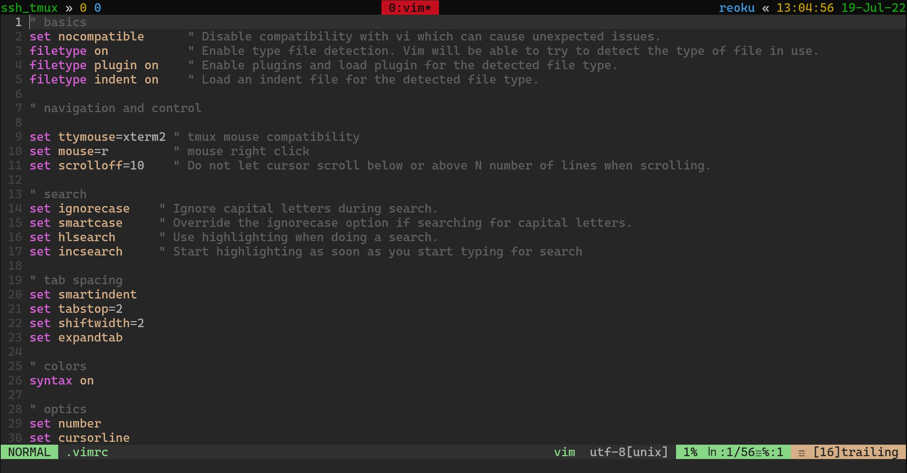

# My Dotfiles


## Initial steps: Git

Make sure you have git installed
```
pacman -Syu --noconfirm git
```
or
```
apt install git
```
Cache access token:
```
git config --global credential.helper cache
```

## Clone and install repo
```
git clone https://github.com/SkyLightEffect/my-server-dotfiles.git ~/.dotfiles && sh ~/.dotfiles/init.sh
```
